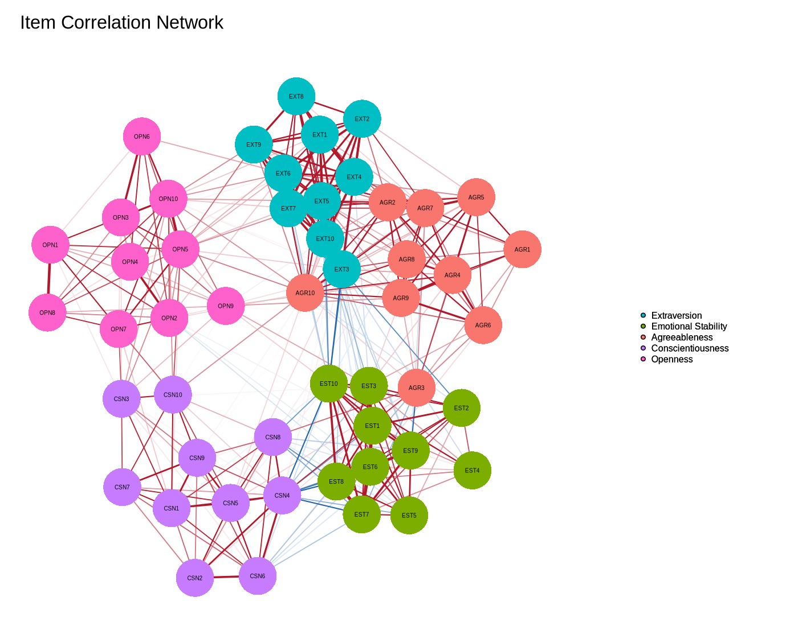
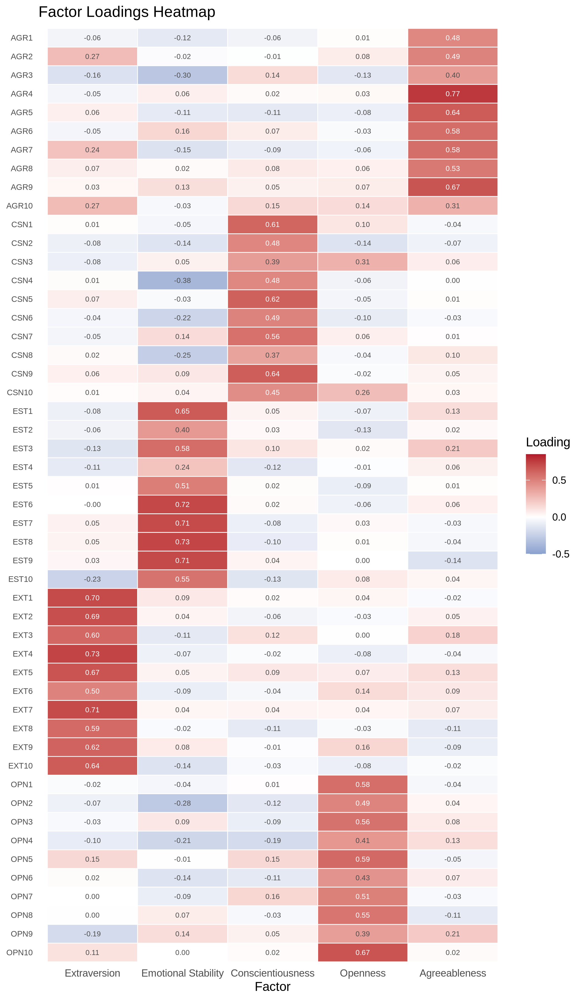
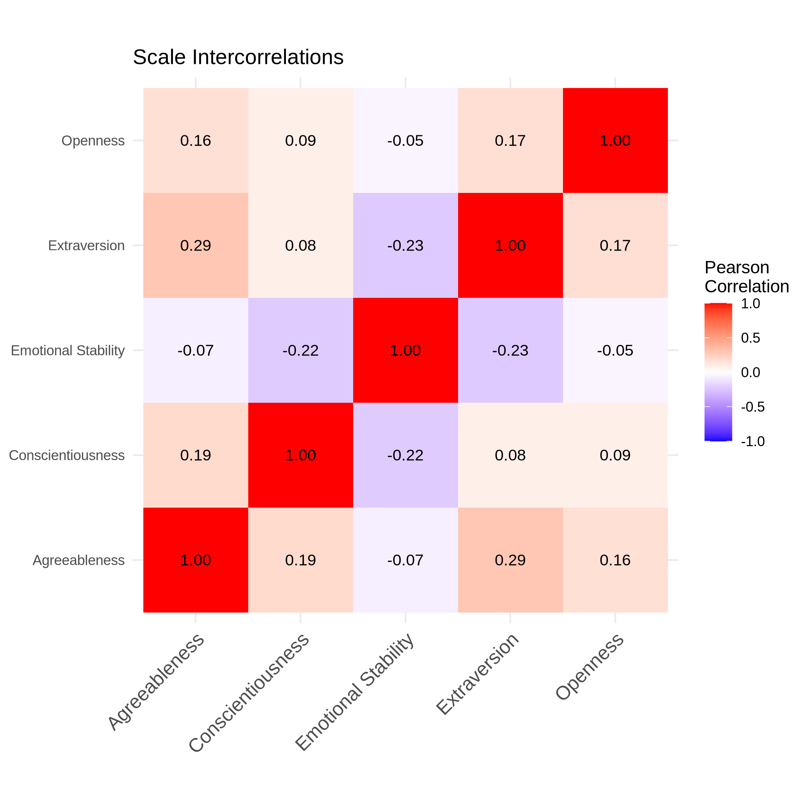
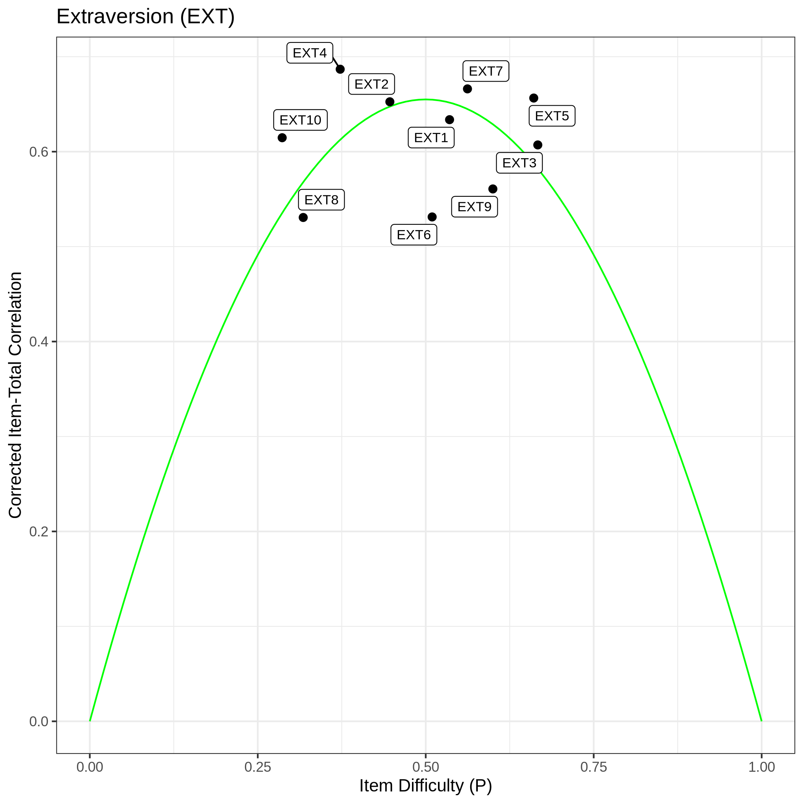
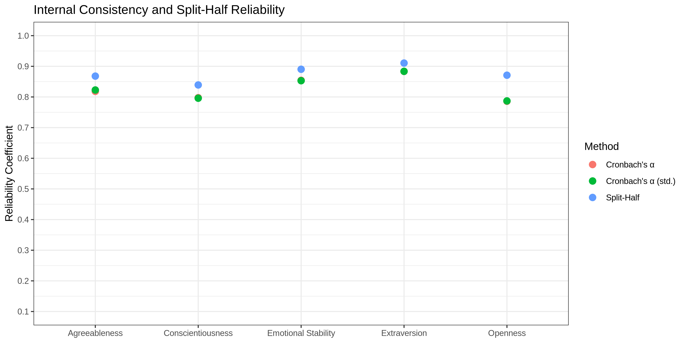

# Big Five Personality Test: Item & Scale Analysis

Psychometric analysis of the 50-item [IPIP Big Five Factor Markers](https://openpsychometrics.org/tests/IPIP-BFFM/) questionnaire in R, including item statistics, factor analysis, and reliability estimation.

<p align="center">
  
  
</p>

<p align="center">
  
  
  
</p>

## Data

This project uses the [Big Five Personality Test](https://www.kaggle.com/datasets/tunguz/big-five-personality-test) dataset from Kaggle (~1M responses to the 50-item IPIP Big Five questionnaire).

## Setup

1. **Install R** (>= 4.0) from [r-project.org](https://www.r-project.org/)
2. **Download the data** from [Kaggle](https://www.kaggle.com/datasets/tunguz/big-five-personality-test) and place `data-final.csv` into the `src_data/` folder
3. **Install packages** by running `setup.R`:
   ```r
   source("setup.R")
   ```

Alternatively, download the data via the Kaggle CLI:
```bash
kaggle datasets download -d tunguz/big-five-personality-test -p src_data/ --unzip
```

## Scripts

The scripts are meant to be run in order. Each script sources its dependencies automatically.

| Script | Content |
|--------|---------|
| `01_data_preparation.R` | Load data, define item metadata, recode negatively keyed items, compute scale scores |
| `02_item_analysis.R` | Item descriptives, item histograms, corrected item-total correlations, difficulty-discrimination plots |
| `03_scale_analysis.R` | Dimension descriptives & histograms, scale intercorrelations, exploratory factor analysis (heatmap, network), parallel analysis, reliability |

## Big Five Dimensions

| Code | Dimension | Items |
|------|-----------|-------|
| EXT | Extraversion | EXT1 -- EXT10 |
| EST | Emotional Stability | EST1 -- EST10 |
| AGR | Agreeableness | AGR1 -- AGR10 |
| CSN | Conscientiousness | CSN1 -- CSN10 |
| OPN | Openness | OPN1 -- OPN10 |

Negatively keyed items are recoded in `01_data_preparation.R`.

## Required R Packages

tidyr, dplyr, moments, ggplot2, ggrepel, scales, Hmisc, psych, nFactors, qgraph

Install all at once via `setup.R` or manually:
```r
install.packages(c("tidyr", "dplyr", "moments", "ggplot2", "ggrepel",
                    "scales", "Hmisc", "psych", "nFactors", "qgraph"))
```

## License

The IPIP items are in the public domain ([ipip.ori.org](https://ipip.ori.org/)). The Kaggle dataset was collected by [Open Psychometrics](https://openpsychometrics.org/).
